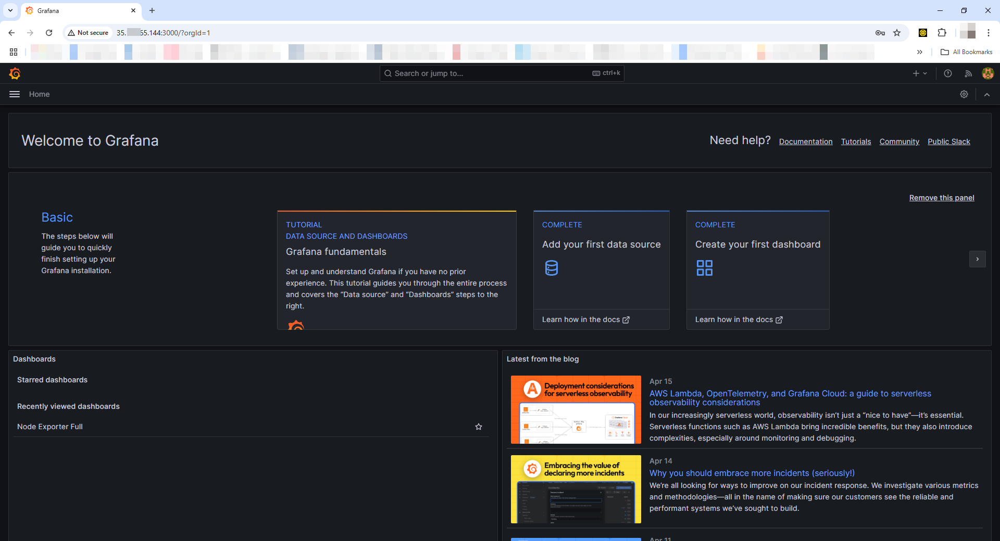
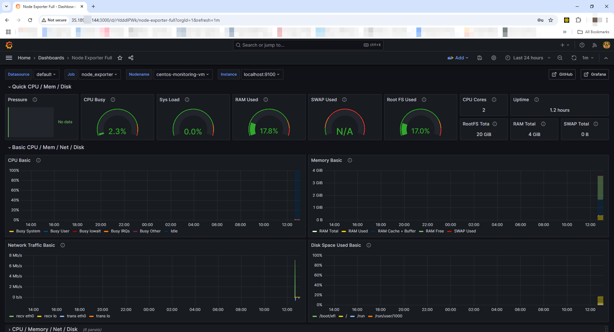

# 🖥️ RHEL Monitoring with Prometheus + Grafana on Google Cloud

This project demonstrates how to set up a complete monitoring stack on a CentOS (Red Hat-based) VM in Google Cloud using:

- Prometheus for time-series monitoring
- Node Exporter to expose system metrics
- Grafana for dashboard visualization

---

## 🔧 Tools Used

- Google Cloud Platform (GCP)
- CentOS 9 Stream (RedHat-based)
- Prometheus
- Node Exporter
- Grafana

---

## 🚀 Project Overview

1. A Linux VM (CentOS 9) is created on GCP Compute Engine.
2. Node Exporter is installed and exposes system metrics at `:9100/metrics`.
3. Prometheus is installed to scrape metrics from the Node Exporter endpoint.
4. Grafana is installed and connected to Prometheus as a data source.
5. A pre-built dashboard (ID `1860`) is imported to visualize metrics such as CPU, memory, disk I/O, and network usage.

---

## 🔧 Step-by-Step Installation Guide

> Tested on CentOS 9 Stream (GCP VM)

### ✅ 1. Create a user for Node Exporter

```bash
sudo useradd --no-create-home --shell /bin/false node_exporter

### ✅ 2. Install Node Exporter
```bash
curl -LO https://github.com/prometheus/node_exporter/releases/download/v1.8.0/node_exporter-1.8.0.linux-amd64.tar.gz
tar xvf node_exporter-1.8.0.linux-amd64.tar.gz
sudo cp node_exporter-1.8.0.linux-amd64/node_exporter /usr/local/bin/
sudo chown node_exporter:node_exporter /usr/local/bin/node_exporter

### ✅ 3. Create a systemd service for Node Exporter
```bash
sudo tee /etc/systemd/system/node_exporter.service > /dev/null <<EOF
[Unit]
Description=Node Exporter
Wants=network-online.target
After=network-online.target

[Service]
User=node_exporter
Group=node_exporter
Type=simple
ExecStart=/usr/local/bin/node_exporter

[Install]
WantedBy=multi-user.target
EOF
```bash
sudo systemctl daemon-reload
sudo systemctl start node_exporter
sudo systemctl enable node_exporter

### ✅ 4. Install Prometheus
```bash
sudo useradd --no-create-home --shell /bin/false prometheus
curl -LO https://github.com/prometheus/prometheus/releases/download/v2.52.0/prometheus-2.52.0.linux-amd64.tar.gz
tar xvf prometheus-2.52.0.linux-amd64.tar.gz
cd prometheus-2.52.0.linux-amd64
sudo cp prometheus /usr/local/bin/
sudo cp promtool /usr/local/bin/
sudo mkdir -p /etc/prometheus /var/lib/prometheus
sudo cp -r consoles/ console_libraries/ /etc/prometheus/

### ✅ 5. Prometheus Configuration
   Create this config file:
```bash
sudo nano /etc/prometheus/prometheus.yml
   Paste this content:
```bash
global:
  scrape_interval: 15s

scrape_configs:
  - job_name: 'node_exporter'
    static_configs:
      - targets: ['localhost:9100']

### ✅ 6. Create a systemd service for Prometheus
```bash
sudo tee /etc/systemd/system/prometheus.service > /dev/null <<EOF
[Unit]
Description=Prometheus
Wants=network-online.target
After=network-online.target

[Service]
User=prometheus
Group=prometheus
Type=simple
ExecStart=/usr/local/bin/prometheus \
  --config.file=/etc/prometheus/prometheus.yml \
  --storage.tsdb.path=/var/lib/prometheus/ \
  --web.console.templates=/etc/prometheus/consoles \
  --web.console.libraries=/etc/prometheus/console_libraries

[Install]
WantedBy=multi-user.target
EOF
```bash
sudo chown -R prometheus:prometheus /etc/prometheus /var/lib/prometheus
sudo systemctl daemon-reload
sudo systemctl start prometheus
sudo systemctl enable prometheus

### ✅ 7. Install Grafana
```bash
sudo dnf install -y https://dl.grafana.com/oss/release/grafana-10.3.1-1.x86_64.rpm
sudo systemctl enable grafana-server
sudo systemctl start grafana-server

### ✅ 8. Access and Configure Grafana

Open in browser: http://[VM-IP]:3000
Login: admin / admin
Change password when prompted

### 📊 Grafana Setup
1. Go to Settings → Data Sources → Add data source
2. Choose Prometheus
3. Set URL to: http://localhost:9090
4. Click Save & Test

### 📈 Import Node Exporter Dashboard
1. Go to Dashboard → New → Import
2. Enter Dashboard ID: 1860
3. Select Prometheus as data source
4. Click Import

---

## 📊 Screenshots




---

## 💡 Observability Outcome

This stack enables real-time insights into VM performance and system health. It reflects an on-premises-like environment in a cloud context — replicating exactly what Platform Engineers and Infra teams deal with daily.

---

## 🛡️ Designed For

- Platform Engineering Interviews
- Infrastructure Monitoring Showcases
- GitHub Portfolio Projects


